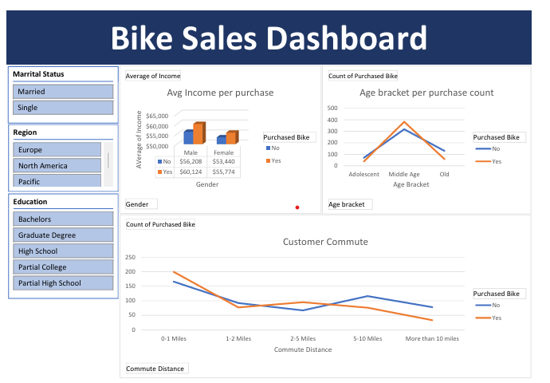

<h1>Bike Sales Analysis Dashboard </h1>
<h3>Project Overview</h3> 

This project analyzes a bike sales dataset and provides insights into customer demographics, purchasing behavior, and sales trends. Using Excel data cleaning, pivot tables, and dashboards, the analysis helps understand factors influencing bike purchases.

<h3>Dataset</h3> 

Source: Provided dataset (bike_buyers sheet).

Size: Includes demographic and sales-related attributes such as age, gender, income, commute distance, and purchase decision.

<h3>Steps Performed</h3> 

1. Data Cleaning (Working Sheet)

2. Removed duplicates and missing values

3. Standardized categorical fields (e.g., Gender, Marital Status, Commute Distance)

4. Data Analysis (Pivot Table)

Created pivot tables to identify trends in:

   1. Income vs Bike Purchase

   2. Age groups and purchasing patterns

   3. Commute distance impact on buying decision

 <b>Dashboard Creation</b>

Designed an interactive Excel dashboard with slicers and charts
</img>
Key metrics displayed:

   1. Average income of buyers vs non-buyers

   2. Age group trends

   3. Commute distance effect

   4. Gender comparison in bike purchasing

<h2><b> Key Insights </b></h2>

<b>1. Higher income groups are more likely to purchase bikes</b>

<b>2. Middle-aged individuals (31–54) show higher purchase rates</b>

<b>3. Shorter commute distances increase likelihood of buying a bike </b>

<b>4. Gender differences exist but income and commute distance are stronger predictors</b>

<h4>Files Included</h4>

bike-sales_analysis-dashboard.xlsx → Complete project file with dataset, analysis, and dashboard

<h5>Tools Used</h5> 

Microsoft Excel: Data cleaning, pivot tables, dashboard creation
